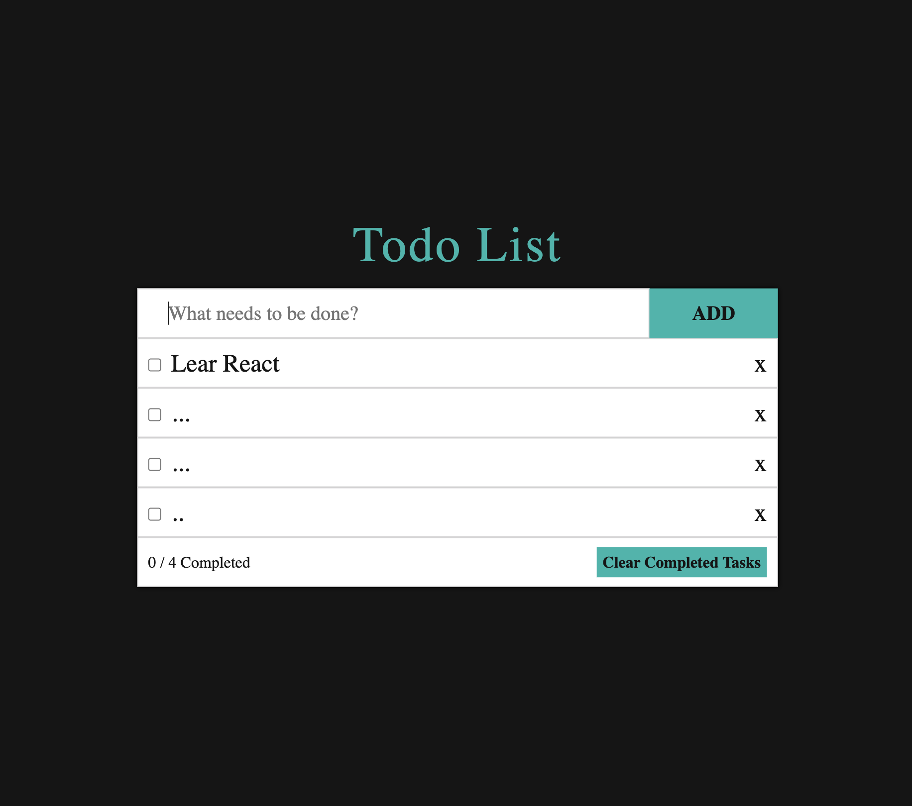

# Simple Todo Web App

A straightforward to-do list to keep track of your tasks.

## Screenshot

Screenshot of the Simple Todo app: 

## Features

Add new tasks
Remove individual tasks
Mark tasks as done
View all tasks, including completed and pending
See the number of remaining tasks
Clear all completed tasks at once
## Usage

Open the web app in your browser. (Provide the URL or instructions for accessing the app)
Add a new task:
Type your task in the input field provided.
Click the "Add Task" button.
View all tasks:
All tasks will be displayed in a list, showing their completion status.
Mark a task as done:
Click the checkbox or button next to the task you want to mark as done.
Remove a task:
Click the "Remove" button or icon next to the task you want to delete.
Clear all done tasks:
Click the "Clear Completed" button to remove all tasks marked as done.
See remaining tasks:
The number of remaining tasks will be displayed prominently on the page.

### Installation

1. Clone the repository: `git clone https://github.com/arsenbadalyan/todo-list`
2. Navigate to the project directory: `cd todo-list`
3. Install dependencies: `npm install`
4. Run: `npm run start`

## Notes

Tasks are stored locally in your browser's storage, so they will persist across sessions.
This is a basic to-do app, and it does not support features like setting priorities, deadlines, or reminders.
## Contributing

Feel free to contribute to the project by suggesting features, reporting bugs, or making code changes!